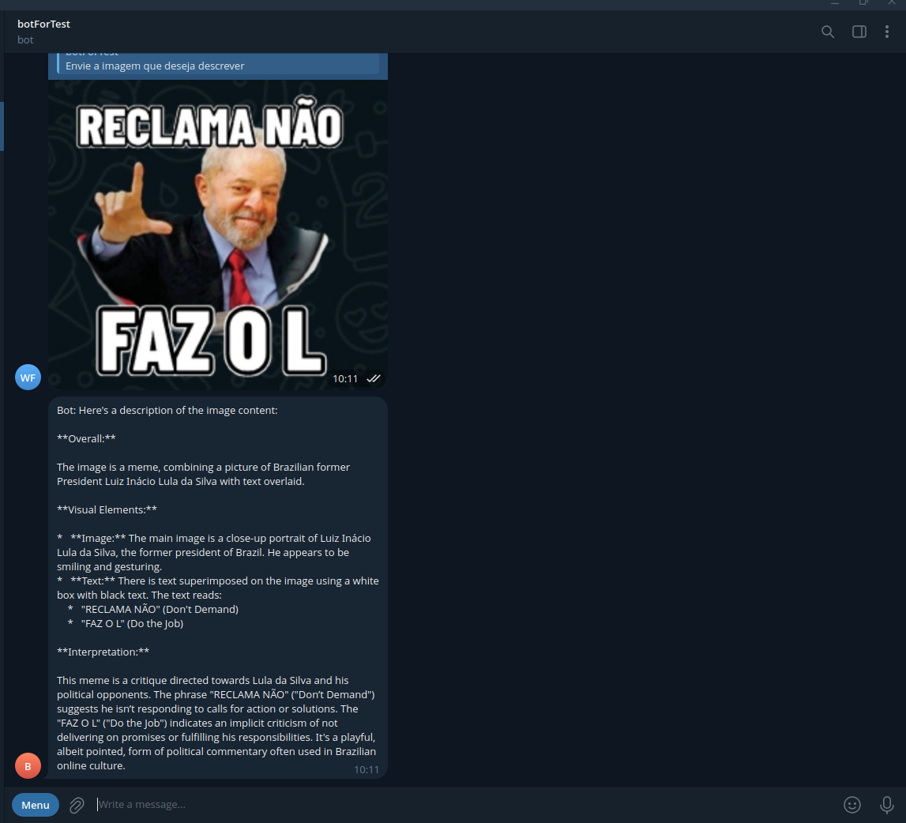

Criação do ambiente virtual:

`conda create -y -n telegram-and-llm-for-all`

Ativação do ambiente virtual:
`conda activate telegram-and-llm-for-all`

Instalação das libs:

`pip3 install -r requirements.txt`

Rodar o serviço de LLM:
`ollama run <LLM_NAME>`

Por exemplo:
`ollama run gemma3:4b-it-qat`

Configurações:

Criação de um arquivo '.env' com os dados da máquina de produção. Veja o `.env.test` como exemplo.

# Exemplo de descrição da imagem:

No chat do telegram com o bot, digite o comando `/describeImage`

Obs.: <LLM_NAME> Precisa ser o mesmo que o nome do llm do arquivo .env
